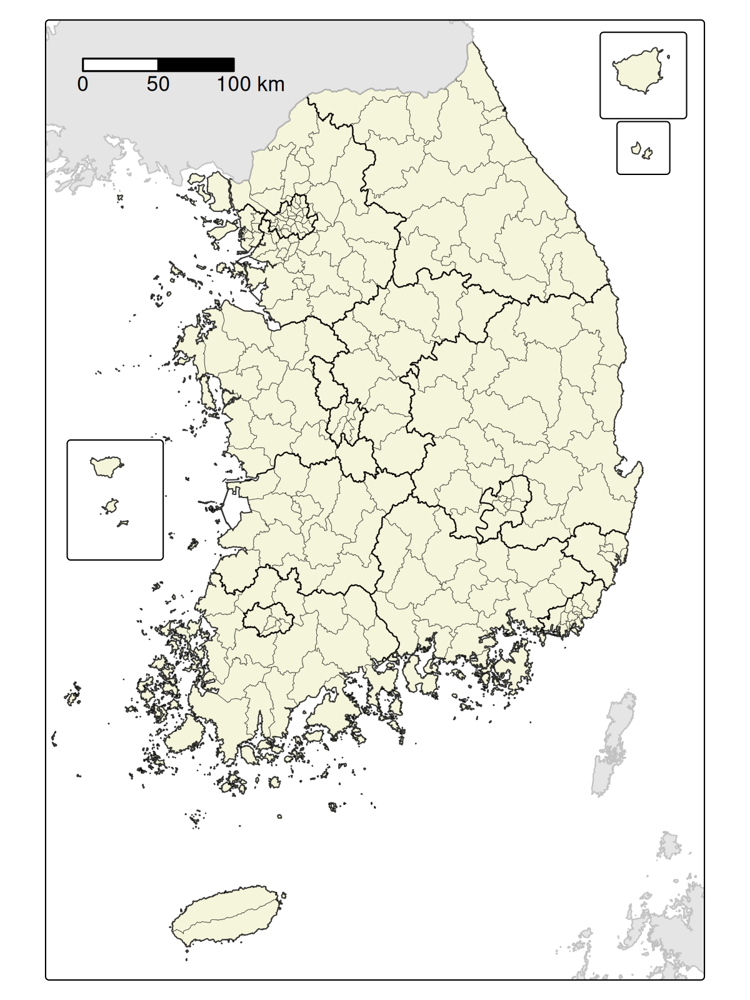

```{r, include = FALSE}
knitr::opts_chunk$set(
  collapse = TRUE,
  comment = "#>",
  warning = FALSE,
  message = FALSE,
  out.width = "100%"
)

library(ggplot2)
library(sf)
library(dplyr)
library(tidyr)
library(tidycensussfkr)
```


## Getting Started with tidycensuskr

The `tidycensuskr` package provides easy access to South Korean census and socioeconomic statistics, along with corresponding geospatial boundary data. With this package, R users can query and visualize population, housing, economy, tax, and mortality data linked to administrative districts.

Load the package:
```{r, include = TRUE}
library(tidycensuskr)

```


## 1. Understanding Korean Geographic Hierarchies

South Korean census data is organized by three levels of administrative divisions:

- **_Si-Do_**: The highest level of administrative division.
  - Metropolitan cities are treated as provinces.
  - Jeju-do, Gangwon-do, and Jeollabuk-do have special self-governing status under Korean law.
- **_Si-Gun-Gu_**: The second level, which includes cities and counties.
  - **_Si_**: Cities (urban administrative units)
  - **_Gun_**: Counties (rural areas, typically <50,000 population)
  - **_Gu_**: Districts (urban subdivisions of metropolitan cities or large cities).
    - _Gu_ under metropolitan cities are autonomous districts
    - _Gu_ under 11 large cities, as of 2025 (i.e., Suwon-si, Seongnam-si, Anyang-si, Goyang-si, Ansan-si, Yongin-si, Cheongju-si, Cheonan-si, Pohang-si, Changwon-si, Jeonju-si), are administraitve districts 
- **_Eup-Myeon-Dong_**: The third level, which includes town and districts. (_planned for future releases_)
  - **_Eup_**: Towns (urban, >20,000 population, within a county)
  - **_Myeon_**: Townships (rural, <20,000 population, within a county)
  - **_Dong_**: Neighborhoods (smallest units within cities and districts)

### Comparison of Administrative Divisions  

The table below provides a rough comparison of administrative divisions across South Korea, the United States, the European Union, and the United Kingdom (England). While the correspondence is not exact, it can be helpful to understand the approximate levels when working with census or regional data.  

| South Korea       | US                                         | EU (NUTS[^1]) | UK (England)                     |
|-------------------|-------------------------------------------|---------------|----------------------------------|
| **Si/Do**         | State                                     | NUTS1         | Regions / Combined Authorities   |
| **Si/Gun/Gu**     | County                                    | NUTS2         | County                           |
| **Eup/Myeon/Dong**| Townships / Towns / Census County Division | NUTS3         | Districts / Wards / Boroughs     |

[^1]: NUTS: *Nomenclature of Territorial Units for Statistics*, a geocode standard for referencing the subdivisions of countries for statistical purposes.  





Because administrative boundaries and coding systems can vary across years and data sources, `tidycensuskr` harmonizes codes to allow consistent integration of statistics. 
Currently, for 2020 data there are 250 _Si-Gun-Gu_ and 17 _Si-Do_.
```{r, include = TRUE}
adm2_2020 <- load_districts(year = 2020)
print(length(unique(adm2_2020$adm2_code)))

```


## 2. Available census data
The package provides census and survey data through:  
  - The function `anycensus()` for querying subsets  
  - The built-in dataset `censuskor` in long format  


### Data types
<div style="font-size:80%;">
| type       | class1        | class2  | unit               | description                              | available_years | data_provider                |
|------------|---------------|---------|--------------------|------------------------------------------|-----------------|------------------------------|
| population | all households| total   | persons            | Total population                         | 2010, 2015, 2020| Statistics Korea             |
| population | all households| male    | persons            | Male population                          | 2010, 2015, 2020| Statistics Korea             |
| population | all households| female  | persons            | Female population                        | 2010, 2015, 2020| Statistics Korea             |
| economy    | company       | total   | count              | Number of business entities              | 2010, 2015, 2020| Statistics Korea             |
| housing    | housing types | total   | count              | Total number of housing units            | 2010, 2015, 2020| Statistics Korea             |
| tax        | income        | general | million KRW        | Comprehensive Income Tax                 | 2020            | National Tax Service         |
| tax        | income        | labor   | million KRW        | Employment Income Tax                    | 2020            | National Tax Service         |
| mortality  | All causes    | total   | per 100k population| Age-standardized mortality rate          | 2020            | Statistics Korea (Survey)    |
| mortality  | All causes    | male    | per 100k population| Age-standardized mortality rate (male)   | 2020            | Statistics Korea (Survey)    |
| mortality  | All causes    | female  | per 100k population| Age-standardized mortality rate (female) | 2020            | Statistics Korea (Survey)    |
</div>


### Query data using `anycensus()`

The function `anycensus()` returns a tidy tibble with columns such as:

- `year`: year of the dataset
- `adm1`, `adm1_code`: Si-Do (province) level administrative unit name and its corresponding code 
- `adm2`, `adm2_code`: Si-Gun-Gu (district) level administrative unit name and its corresponding code 

Columns containing the values are added as a wide form. The column `adm2_code` links census data directly to boundary files retrieved with `load_districts()`.

```{r, include = TRUE}
df_2020 <- anycensus(year = 2020, 
                     type = "mortality",
                     level = "adm2")
head(df_2020)

```
The function can also aggregate values to higher administrative units. By specifying `level = "adm1"` and providing an aggregation function, we obtain province-level (`adm1`) results that summarize across all districts.

```{r, include = TRUE}
df_2020_sido <- anycensus(year = 2020, 
                          type = "mortality",
                          level = "adm1",
                          aggregator = sum,
                          na.rm = TRUE)
head(df_2020_sido)

```

### Built-in dataset `censuskor`

You can access the whole dataset directly using the function `data(censuskor)` which returns the built-in dataset in a long form. 

- `year`: year of the dataset
- `adm1`, `adm1_code`: Si-Do (province) level administrative unit name and its corresponding code  
- `adm2`, `adm2_code`: Si-Gun-Gu (district) level administrative unit name and its corresponding code 
- `type`: Types of census or survey
- `class1`, `class2`: Classification variables providing further breakdowns
- `unit`: Measurement unit for the value
- `value`: The observed census value for the given combination of year, region, and category  

```{r, include = TRUE}
data(censuskor)
head(censuskor)

```

### Quick Visualization

Since `anycensus()` returns tidy data, visualization with `ggplot2` is straightforward.

```{r, include = TRUE, fig.width=7, fig.height=4}
ggplot(df_2020, aes(x = `all causes_male_p1p`, y = `all causes_female_p1p`)) +
  geom_point() +
  labs(
    x = "Male mortality (per 100,000 population)",
    y = "Female mortality (per 100,000 population)",
    title = "Male vs. Female Age-standardized Mortality Rates in South Korea (2020)"
  ) +
  theme_minimal(base_size = 10)

```
